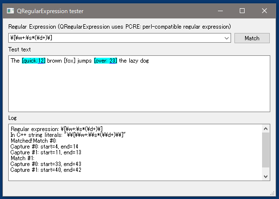

# QRegularExpression tester

## このツールについて
Qt の [QRegularExpresssion](http://doc.qt.io/qt-5/qregularexpression.html) による正規表現のテストプログラムです。
[QRegularExpression](http://doc.qt.io/qt-5/qregularexpression.html) は
[PCRE](http://pcre.org/)(Perl-compatible regular expression、Perl5 互換の正規表現)を使用しており
他のプログラミング言語やソフトウェアでも広く使われています。

Qt でプログラミングをしている方、手元に正規表現を手軽に試す環境がない方は、
本ソフトで思う存分書き散らかして下さい。

## 実行ファイルの入手方法
Windows(x64)用バイナリが bin/win-x64/QRegularExpressionTester.exe にありますのでダウンロードして下さい。
他のプラットフォームの方は、お手数ですがソースコードからビルドして下さい。

## 使い方
- Regular Expression の欄に正規表現を入力して下さい。
- Test text の欄に試しにマッチさせてみたいテキストを入力して下さい。
- テキスト変更で即座にマッチ結果が表示されます(そのためMatch ボタンは不要になったはず)

Test text 内にマッチしたテキストが水色でハイライトされます。
また、Log 欄には
- 入力した正規表現
- C/C++ 文字列リテラル内に記述する場合の表記("\"が二重になっています)
- キャプチャされた文字位置とマッチした文字列

が表示されます。

## ソースコードのビルド方法
Qt Creator が必要となります。(Community版で問題ありません)
[Qt 公式サイト](https://www.qt.io/)の[ダウンロードページ](https://www.qt.io/download/)からダウンロード・インストールしてください。

Qt Creator を起動したら、src/QRegularExpressionTester.pro を読み込んでビルドして下さい。

